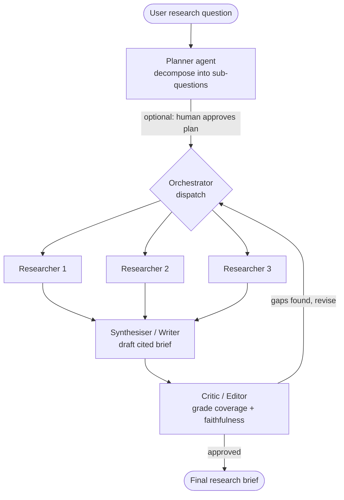

# Capstone Project-5: Multi-Agent Research Analyst — Building an Agentic AI System with LangGraph

---

## Problem Statement

A single call to a Large Language Model (LLM) is fast but fundamentally limited: it cannot access information beyond its training cut-off, it cannot verify its own claims, and when asked a complex, multi-part question it tends to produce a confident but shallow (and sometimes hallucinated) answer. Real analytical work is not a single step — it involves **planning** what to investigate, **gathering** evidence from multiple sources, **synthesising** that evidence into a coherent narrative, and **critically reviewing** the result before it is trusted.

The objective of this capstone is to build an **Agentic AI system** — a *Multi-Agent Research Analyst* — that takes an open-ended research question (e.g., *"Compare the current electric-vehicle strategies of Tata Motors and BYD"*) and autonomously produces a well-structured, **citation-backed research brief**. Unlike a simple chatbot, the system must **decompose** the task, **use multiple tools** (web search, web-page extraction, a calculator), **delegate** sub-tasks to specialist sub-agents that work in parallel, and **self-correct** through a critic/quality-gate loop before returning the final report.

This project moves the student from a single-tool **AI Agent** (Part 1 of the course) to a true **Agentic AI** system (Part 2): multiple tools, multiple cooperating sub-agents, shared state, conditional routing, and feedback cycles — all orchestrated with **LangGraph**. The system will be built on a free, fully runnable stack (**Groq** for inference, **Tavily** for web search), and will be benchmarked against a single-agent baseline to make the value of orchestration concrete and measurable.

---

## Tech Stack

| Component | Choice | Why |
| --- | --- | --- |
| **LLM inference** | **Groq** running `llama-3.3-70b-versatile` | Free tier, very low latency — ideal for the many LLM calls an agentic loop makes. |
| **Web search** | **Tavily** (`langchain-tavily` → `TavilySearch`) | Search API designed for LLM agents; returns clean, relevant snippets. |
| **Orchestration** | **LangGraph** | Graph-based control flow: shared state, conditional edges, parallel nodes, and cycles. |
| **Agent abstraction** | `create_agent` (from `langchain.agents`) | The current high-level helper that builds the ReAct tool-loop for each sub-agent. |
| **(Optional) Tracing** | **LangSmith** | Inspect every node, tool call, and token for debugging the agent trajectory. |

> **Note on the agent API:** the course notebook uses `from langchain.agents import create_agent` with the `system_prompt=` argument. The older `create_react_agent` from `langgraph.prebuilt` is deprecated; the underlying ReAct loop is identical.

---

## Datasets, Tools & Knowledge Sources

This is an **agentic, tool-using** project, so the "dataset" is not a static file — it is the **live web (via Tavily)** plus a curated set of **evaluation topics** the system must handle. Students must implement the following **tool layer**, which the sub-agents call as needed.

### Tools to implement

| Tool | Library / Source | Purpose |
| --- | --- | --- |
| `web_search` | Tavily (`TavilySearch`, `max_results=3–5`) | Find current, relevant sources for a sub-question. |
| `extract_page` | `TavilyExtract`, **or** a custom `@tool` using `requests` + `BeautifulSoup` | Pull the full text of a promising URL for deeper reading. |
| `calculator` | Custom `@tool` (safe arithmetic via `ast`) | Exact computation on figures the agents find (growth %, ratios, totals). |
| `wikipedia` *(optional)* | `langchain_community` → `WikipediaQueryRun` | Stable background/definitions. |
| `python_repl` *(optional, advanced)* | `langchain_experimental` → `PythonREPLTool` | Quick data manipulation / numeric analysis. |

### Evaluation topic set (the "test dataset")

Run the system on **at least 6** of the following open-ended questions (or design your own of similar complexity). These deliberately require multiple sources and reasoning steps — not a single lookup.

1. Compare the current EV strategies of **Tata Motors** and **BYD**.
2. What are the main causes and the latest policy responses to **urban air pollution in Delhi**?
3. Summarise the **2024–2025 advances in small open-weight language models** and who is leading.
4. Assess the investment case for **green hydrogen in India**: drivers, risks, key players.
5. How are major **cloud providers pricing GPU compute** in 2026, and how do they compare?
6. What is the current state of **India's semiconductor manufacturing push** (fabs, subsidies, partners)?
7. Compare **GLP-1 weight-loss drugs** (e.g., semaglutide vs tirzepatide): efficacy, cost, supply.
8. What happened in the most recent **UEFA Champions League final**, and how did the winning side get there?

> Topics 3, 5, 6, and 8 are time-sensitive **on purpose** — they expose how a no-tool baseline fails, and why search-augmented agents are needed.

---

## Objectives

1. **Build a baseline single-tool agent** (web search only) to establish a reference point and to recap the Part-1 "AI Agent" concept.
2. Implement a reusable **tool layer** (search, page-extraction, calculator, and at least one optional tool).
3. Design a **shared graph state** (using a typed dictionary and **reducers**) that all agents read from and write to.
4. Implement **specialist sub-agents**: a **Planner**, parallel **Researchers**, a **Synthesiser/Writer**, and a **Critic/Editor**.
5. **Orchestrate** the sub-agents with LangGraph using **conditional edges** (routing), **parallel fan-out/fan-in**, and a **cycle** (the critic loop).
6. Explicitly realise the **three multi-agent patterns** taught in the course — *Planner–Executor*, *Orchestrator–Workers*, and *Evaluator–Optimizer*.
7. Add **persistence (checkpointing)** and an optional **human-in-the-loop** approval of the research plan.
8. Produce a **citation-backed research brief** as structured, grounded output.
9. **Evaluate** the system (LLM-as-judge rubric, citation faithfulness, tool-trajectory inspection) and **compare** it against the single-agent baseline.
10. *(Optional)* Deploy an interactive **Streamlit** app that streams the agents' reasoning live.

---

## System Architecture

The system should follow the orchestrated multi-agent flow below. Each labelled block maps to one of the course's reusable patterns.



**Pattern mapping (tie back to the slide):**

| Component | Multi-agent pattern |
| --- | --- |
| Planner → Orchestrator dispatch | **Planner–Executor** |
| Orchestrator → parallel Researchers → Synthesiser | **Orchestrator–Workers** (parallel fan-out / fan-in) |
| Synthesiser ⇄ Critic loop | **Evaluator–Optimizer** |

---

## Steps to Follow

### **1. Environment Setup**

- Install the stack:
  ```bash
  pip install -U langgraph langchain langchain-groq langchain-tavily python-dotenv beautifulsoup4 requests
  ```
- Obtain free API keys from **console.groq.com** and **app.tavily.com**; load them via a `.env` file (never hard-code keys).
- Instantiate the model: `ChatGroq(model="llama-3.3-70b-versatile", temperature=0)`.

### **2. Build the Tool Layer**

- Implement each tool from the **Tools to implement** table using the `@tool` decorator from `langchain_core.tools`.
- Write **clear docstrings** — the LLM uses the docstring to decide *when* to call a tool, so this is part of the engineering.
- For the calculator, use a **safe** arithmetic evaluator (parse with `ast`, never raw `eval`).

### **3. Baseline Single-Tool Agent (Part-1 recap)**

- Build a single ReAct agent with **only** `web_search` using `create_agent(llm, tools=[web_search], system_prompt=...)`.
- Run it on 2–3 of the evaluation topics and **save the outputs** — this is your comparison baseline for Step 9.

### **4. Design the Shared State**

- Define a `TypedDict` state containing at least: `question`, `plan` (list of sub-questions), `findings` (annotated with an `operator.add` **reducer** so parallel researchers can append safely), `draft`, `critique`, `iterations`, and `approved`.
- Explain in a markdown cell **why** the reducer is required for parallel writes.

### **5. Build the Specialist Sub-Agents**

- **Planner** — an LLM node that decomposes the question into 3–5 focused sub-questions and returns them as a list.
- **Researcher** — a ReAct agent (tools: `web_search` + `extract_page`) that investigates **one** sub-question and returns a short, **source-attributed** finding. The same agent definition is reused for all parallel researchers.
- **Synthesiser/Writer** — an LLM node that combines all `findings` into a structured brief **with inline citations** (e.g., `[1]`, `[2]`) and a reference list.
- **Critic/Editor** — an LLM node that grades the draft on **coverage, faithfulness, and citation quality**, and returns either `APPROVED` or a list of concrete gaps to fix.

### **6. Orchestrate with LangGraph**

- Create a `StateGraph`; add each agent as a node.
- **Planner → dispatch:** wire the planner first (*Planner–Executor*).
- **Parallel research:** fan out from the dispatch step to multiple researcher nodes that run in the **same superstep**, then fan in to the synthesiser (*Orchestrator–Workers*). (Hint: use `Send` for a dynamic number of researchers, or a fixed set of researcher nodes for a simpler implementation.)
- **Critic loop:** add a **conditional edge** from the critic — if not approved **and** `iterations < MAX`, route back to dispatch/synthesiser; otherwise go to `END` (*Evaluator–Optimizer*).
- Always include an **iteration cap** (e.g., `MAX = 3`) to prevent infinite loops.
- Visualise the compiled graph (`graph.get_graph().draw_mermaid()` / `draw_mermaid_png()`).

### **7. Persistence & Human-in-the-Loop (Advanced)**

- Compile with a checkpointer (`from langgraph.checkpoint.memory import InMemorySaver`) and run with a `thread_id` so the run can be paused, resumed, and remembered across turns.
- *(Optional)* Add an **interrupt** after the Planner so a human can **approve or edit the research plan** before any searches run.

### **8. End-to-End Runs**

- Run the full system on **at least 6** evaluation topics.
- For each run, **stream and capture** the trajectory: which sub-questions were planned, which tools each researcher called, and how many critic iterations were needed.

### **9. Evaluation**

Use both **quantitative** and **qualitative** methods.

- **LLM-as-Judge rubric** — have a separate LLM call score each final brief 1–5 on:

  | Criterion | Question |
  | --- | --- |
  | Coverage | Are all parts of the question addressed? |
  | Faithfulness | Is every claim supported by a cited source (no hallucination)? |
  | Citation quality | Do citations point to real, relevant sources? |
  | Coherence | Is the brief well-structured and readable? |

- **Citation / faithfulness check** — manually verify a sample of claims against their cited sources.
- **Tool-trajectory inspection** — confirm the agents selected sensible tools and sub-questions.
- **Baseline vs. multi-agent comparison** — fill in a table like the one below and discuss where and *why* the multi-agent system wins (and where the extra cost/latency is *not* worth it).

  | Topic | Single-agent (baseline) | Multi-Agent Analyst | Winner & why |
  | --- | --- | --- | --- |
  | EV strategy comparison | … | … | … |

- **Cost & latency** — record approximate tokens, number of LLM/tool calls, and wall-clock time per run. Agentic systems are more capable but more expensive; quantify the trade-off.

### **10. Deployment (Optional)**

- Build a **Streamlit** app where the user enters a research question and watches the agents work.
- The interface should display: the **user's question**, the **generated research plan**, a **live trace** of researcher/critic steps, and the **final cited brief** (with the reference list).

---

## Advanced Extensions (Bonus)

Pick one or more to push the project further:

- Add a **domain tool** — `arxiv` (academic deep-dives) or `yfinance` (financial analysis) — and a matching researcher.
- Enforce **structured output** for the final brief using a Pydantic schema (`title`, `sections`, `citations`).
- Add a **guardrail / safety node** that refuses out-of-scope or unsafe requests.
- Use **`Send`** to spawn a **dynamic** number of researchers (one per planned sub-question) instead of a fixed set.
- Enable **LangSmith tracing** and include screenshots of the trajectory in your report.
- Add a **deduplication/merge** step so overlapping findings from different researchers are consolidated before synthesis.

---

## Insights and Conclusion

In the report, reflect on what the experiments reveal. Expected observations include:

- The **single-agent baseline fails or stays shallow** on time-sensitive, multi-part questions, while the multi-agent system produces broader, better-grounded briefs — concretely demonstrating the jump from *AI Agent* to *Agentic AI*.
- The **critic/evaluator loop is the highest-leverage component**: it catches missing sub-topics and unsupported claims that a one-shot pipeline would ship.
- **Parallel researchers** cut latency versus running sub-questions sequentially, but require a **reducer** on shared state to avoid clobbering each other.
- Agentic systems trade **higher cost and latency** for **higher reliability and depth** — students should be able to articulate when that trade-off is (and isn't) worth it.
- Common **failure modes** to discuss: tool errors, hallucinated citations, and runaway loops — and how an **iteration cap**, retries, and human-in-the-loop mitigate them.

---

## Deliverables

1. **Jupyter Notebook (.ipynb):**
Complete notebook implementing the tool layer, the baseline agent, all sub-agents, the LangGraph orchestration (with the graph visualisation), end-to-end runs, and the evaluation.

2. **Project Report (.md or .pdf):**
Summarises the architecture (include the graph diagram), the pattern mapping, the evaluation results, the baseline-vs-multi-agent comparison, and the insights above.

3. **Presentation Slides:** not more than 10 slides summarising the problem, architecture, key results, and learnings.

4. **Sample Outputs File:**
At least **3–5 generated research briefs** (with their citations) plus the corresponding **agent trajectories** (planned sub-questions, tool calls, number of critic iterations), saved as Markdown/CSV.

5. **Optional Deployment:**
A small **Streamlit** app for interactive research, showing the question, the plan, a live trace, and the final cited brief.

---

## Upload the project deliverables

- Upload the solved notebook(s), Codes, Project Report, Presentation Slides, and Sample Outputs file to the Google Drive location: https://drive.google.com/drive/folders/1nHvZkHByVUXKZm31ahwmd4n5dNdHeT8B?usp=drive_link

- Also upload the solved notebook and the documents to your respective GitHub repository.
